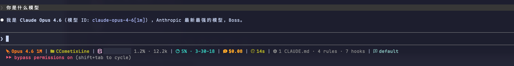

# CCometixLine

[English](README.md) | [中文](README.zh.md)

基于 Rust 的高性能 Claude Code 状态栏工具，融合精美 Nerd Font 渲染与实时会话统计 — 上下文使用率、活动工具、运行中的 Agent、任务进度和环境信息，始终显示在输入框下方。


## 截图



```
 Opus 4.6 | 󰉋 project |  ████░░░░░░ 42.5% · 85k | 󱈔 Read: main.rs 2act 8ok | 󰈙 Explore (15s) | 󰘵 Fix tests 3/5 | 󰒓 2 CLAUDE.md · 4 rules · 3 MCPs
```

## 特性

### 状态栏段落

| 段落 | 图标 | 说明 |
|------|------|------|
| **Model** |  | Claude 模型名，自动提取版本号 |
| **Directory** | 󰉋 | 当前工作目录 |
| **Git** | 󰊢 | 分支、状态（清洁/脏/冲突）、领先/落后 |
| **Context Window** |  | 彩色进度条 + 百分比 + Token 数量 |
| **Usage** | 󰪞 | API 速率限制（5小时/7天），动态圆形图标 |
| **Cost** |  | 会话花费（美元） |
| **Session** | 󱦻 | 时长 + 新增/删除行数 |
| **Tools** | 󰊕 | 活动工具 + 已完成工具计数 |
| **Agents** | 󰚩 | 运行中/已完成 Agent 类型、描述、耗时 |
| **Todos** | 󰄬 | 当前任务 + 进度（已完成/总数） |
| **Environment** | 󰒓 | CLAUDE.md、rules、MCPs、hooks 计数 |
| **Output Style** | 󱋵 | 当前输出样式名称 |
| **Update** |  | 版本检查 |

### 上下文进度条

根据使用率自动变色的可视化进度条：
- **绿色** `████░░░░░░` — 低于 70%
- **黄色** `██████░░░░` — 70%-85%
- **红色** `█████████░` — 高于 85%

### 实时会话监控

解析 Claude Code 的 transcript JSONL 文件，提供实时追踪：

- **活动工具** — 显示当前运行的工具（如 `Read: main.rs`）和已完成工具计数（`8ok`）
- **运行 Agent** — 显示 Agent 类型、描述和耗时（如 `Explore: Find API patterns`）
- **任务进度** — 显示当前进行中的任务和完成比例（如 `Fix tests 3/5`）
- **环境信息** — 统计加载的 CLAUDE.md 文件、规则、MCP 服务器和 Hooks 数量

### 交互式 TUI 配置

- **TUI 配置界面** 实时预览（`ccline -c`）
- **主题系统** — 9 种内置预设（Cometix、Gruvbox、Nord、Powerline 系列等）
- **段落自定义** — 启用/禁用、排序、自定义图标和颜色
- **自定义主题** — 从 `~/.claude/ccline/themes/*.toml` 保存和加载

### Claude Code 增强

- **禁用上下文警告** — 移除 "Context low" 消息
- **启用详细模式** — 增强输出详情
- **稳定补丁器** — 基于 Tree-sitter AST，适应版本更新
- **自动备份** — 安全修改，支持轻松恢复

## 安装

### 快速安装（推荐）

```bash
npm install -g @cometix/ccline
```

使用镜像源加速：
```bash
npm install -g @cometix/ccline --registry https://registry.npmmirror.com
```

### Claude Code 配置

添加到 Claude Code `settings.json`：

```json
{
  "statusLine": {
    "type": "command",
    "command": "~/.claude/ccline/ccline",
    "padding": 0
  }
}
```

> **说明：** `~` 在所有平台通用（macOS/Linux/Windows，需 Claude Code v2.1.47+）。

### 从源码构建

```bash
git clone https://github.com/lucasmen9527/CCometixLine.git
cd CCometixLine
cargo build --release
mkdir -p ~/.claude/ccline
cp target/release/ccometixline ~/.claude/ccline/ccline
```

### 更新

```bash
npm update -g @cometix/ccline
```

<details>
<summary>手动安装（点击展开）</summary>

从 [Releases](https://github.com/lucasmen9527/CCometixLine/releases) 下载：

#### macOS (Apple Silicon)
```bash
mkdir -p ~/.claude/ccline
wget https://github.com/lucasmen9527/CCometixLine/releases/latest/download/ccline-macos-arm64.tar.gz
tar -xzf ccline-macos-arm64.tar.gz && cp ccline ~/.claude/ccline/ && chmod +x ~/.claude/ccline/ccline
```

#### macOS (Intel)
```bash
mkdir -p ~/.claude/ccline
wget https://github.com/lucasmen9527/CCometixLine/releases/latest/download/ccline-macos-x64.tar.gz
tar -xzf ccline-macos-x64.tar.gz && cp ccline ~/.claude/ccline/ && chmod +x ~/.claude/ccline/ccline
```

#### Linux
```bash
mkdir -p ~/.claude/ccline
wget https://github.com/lucasmen9527/CCometixLine/releases/latest/download/ccline-linux-x64.tar.gz
tar -xzf ccline-linux-x64.tar.gz && cp ccline ~/.claude/ccline/ && chmod +x ~/.claude/ccline/ccline
```

#### Windows
```powershell
New-Item -ItemType Directory -Force -Path "$env:USERPROFILE\.claude\ccline"
Invoke-WebRequest -Uri "https://github.com/lucasmen9527/CCometixLine/releases/latest/download/ccline-windows-x64.zip" -OutFile "ccline-windows-x64.zip"
Expand-Archive -Path "ccline-windows-x64.zip" -DestinationPath "."
Move-Item "ccline.exe" "$env:USERPROFILE\.claude\ccline\"
```

</details>

## 使用

### 主题切换

```bash
ccline --theme cometix
ccline --theme gruvbox
ccline --theme nord
ccline --theme powerline-dark
ccline --theme powerline-tokyo-night
```

### Claude Code 增强

```bash
ccline --patch /path/to/claude-code/cli.js
```

## 配置

配置文件：`~/.claude/ccline/config.toml`

所有段落支持：
- 启用/禁用切换
- 自定义 Nerd Font / Emoji 图标
- 16色、256色、RGB 颜色
- 粗体文本样式
- 段落专属选项

### 段落配置示例

```toml
[[segments]]
id = "tools"
enabled = true

[segments.icon]
plain = "🔧"
nerd_font = "󰊕"

[segments.colors.icon]
c256 = 75

[segments.colors.text]
c256 = 75

[segments.styles]
text_bold = false
```

### 模型配置 (`models.toml`)

位置：`~/.claude/ccline/models.toml`

Claude 模型自动识别，此文件用于第三方模型：

```toml
[[models]]
pattern = "glm-4.5"
display_name = "GLM-4.5"
context_limit = 128000

[[context_modifiers]]
pattern = "[1m]"
display_suffix = " 1M"
context_limit = 1000000
```

## 系统要求

- **终端**：需支持 Nerd Font（[nerdfonts.com](https://www.nerdfonts.com/)）
  - 中文用户推荐：[Maple Font](https://github.com/subframe7536/maple-font)
- **Git**：1.5+（推荐 2.22+）
- **Claude Code**：用于状态栏集成

## 开发

```bash
cargo build            # 开发构建
cargo test             # 运行测试
cargo build --release  # 优化构建
```

## 路线图

- [x] TOML 配置文件支持
- [x] TUI 配置界面
- [x] 自定义主题（9 种内置预设）
- [x] 交互式主菜单
- [x] Claude Code 增强工具
- [x] 上下文彩色进度条
- [x] 活动工具追踪
- [x] 运行 Agent 监控
- [x] 任务进度显示
- [x] 环境配置计数

## 贡献

欢迎贡献！请随时提交 Issue 或 Pull Request。

## 致谢

本项目 Fork 自 [Haleclipse](https://github.com/Haleclipse) 的 [CCometixLine](https://github.com/Haleclipse/CCometixLine)，它提供了优秀的基础架构 — 高性能 Rust 状态栏引擎、精美主题系统、TUI 配置器和 Claude Code 补丁工具。

实时会话监控功能（工具追踪、Agent 监控、任务进度、环境计数、上下文进度条）的灵感来自 [Jarrod Watts](https://github.com/jarrodwatts) 的 [claude-hud](https://github.com/jarrodwatts/claude-hud)，它开创性地将实时 transcript 统计信息展示在 Claude Code 状态栏中。

感谢两个项目的出色工作！

## 许可证

本项目采用 [MIT 许可证](LICENSE)。
